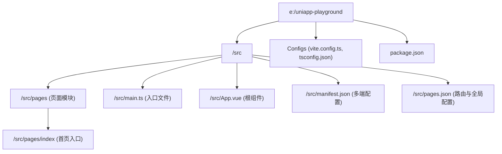

# uni-preset-vue 项目总览

> AI 自动生成的项目上下文索引，最后更新于：2026-03-03T16:56:07+08:00

## 🎯 高层愿景

本项目是一个基于 `Vue 3` 和 `Vite` 构建的 **uni-app** 跨端全栈/前端开发环境配套仓库。主要用于提供一套开箱即用的 uni-app 多端同构解决方案。

## 🗺️ 架构总览

## ⚖️ 全局规范

1. **依赖管理**：基于 pnpm 进行统一的包管理 (目前仅使用 `pnpm-lock.yaml` 约束)。
2. **多端发布**：利用 `package.json` 中的 `uni` 脚本以及 `vite.config.ts` 执行各个平台的编译与打包。
3. **TypeScript**：项目默认开启 TypeScript 支持，全局类型声明统一在 `src/env.d.ts` 与 `src/shime-uni.d.ts` 维护。

---

_由 AI Agent 通过 `/init-project` 指令生成。_
